## From GWAS to Biological Discovery

::: {.center}
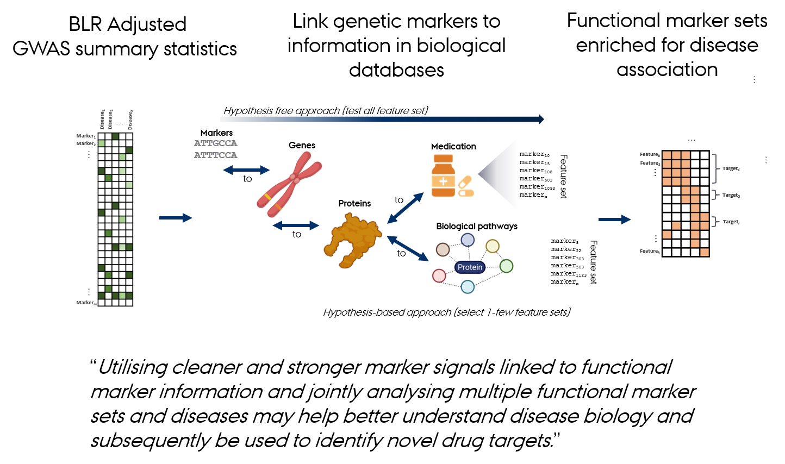{width=80%}
:::

----

## Gene Set Analysis

**Gene set analysis** evaluates the **coordinated action of genes or sets of variants** within predefined biological pathways or functional groups. 

**GWAS** identify single genetic variants (SNPs) associated with traits or diseases.

- **Many variants have small individual effects**  
  → Use larger datasets or make better use of existing data.  

- **Some effects are clustered within functionally related genes or pathways**  
  → Use prior information on functional marker groups to improve detection power and interpretation.  

- **Some effects are shared across multiple traits**  
  → Leverage correlated trait information to enhance detection power and prediction accuracy.

----

## Gene Set Analyses

Many different gene set analysis approaches have been proposed. 

- **MAGMA**: Multi-marker Analysis of GenoMic Annotation (Leuww et al 2015)

  - generalized gene set analysis of GWAS data
  - based on a multiple regression model
  - rank gene sets

- **PoPS**: Polygenic Prioritisation Scoring (Weeks et al 2023) 

  - leveraging polygenic enrichment of gene features (e.g. gene sets) to predict genes underlying  complex diseases 
  - based on a multiple regression model
  - rank genes

----

## Gene Set Analyses

Many different gene set analysis approaches have been proposed. 

- <strong>MAGMA</strong>: Multi-marker Analysis of GenoMic Annotation (Leuww et al 2015)

  - generalized gene set analysis of GWAS data
  - based on a multiple regression model
  - rank gene sets

- **PoPS**: Polygenic Prioritisation Scoring (Weeks et al 2023) 

  - leveraging polygenic enrichment of gene features (e.g. gene sets) to predict genes underlying  complex diseases 
  - based on a multiple regression model
  - rank genes

---

## MAGMA: Linear Model Approach

**MAGMA** fits a **linear regression model** to test associations between **gene sets** and traits.

1. Aggregate **SNP-level GWAS statistics** into **gene-level statistics**, accounting for LD.  
2. Use gene-level statistics as the **response variable**.  
3. Represent gene sets as a **predictor matrix**, typically indicating gene membership, but not necessarily limited to binary values.  
4. Estimate regression coefficients to assess the **strength of association** between each gene set and the trait.  
5. Evaluate significance using **permutation** or **model-based null distributions**.

---

## MAGMA: Limitations

When analyzing thousands of gene sets, several issues arise:  
  - **Overfitting** – the model may capture noise rather than true signals.  
  - **Multicollinearity** – many gene sets are correlated due to biological overlap.  
  - **Multiple testing** – increases false-positive risk.  
  - **Interpretation difficulty** – hard to disentangle contributions of overlapping sets.  

  → Use of **regularization** and **variable selection** to improve model robustness and interpretability.  

Additionally, many complex traits are **genetically correlated**, sharing overlapping biological pathways.  

  → Incorporating **multi-trait information** in MAGMA can increase detection power and reveal shared genetic mechanisms across traits.

---

## Bayesian MAGMA: Idea

Develop and evaluate a **Bayesian gene-set prioritization approach** using BLR within the MAGMA framework.

- Advantages:  
  - Incorporates **regularization** and **variable selection** via **spike-and-slab priors**.  
  - Controls false positives and **handles overlapping gene sets**.  
  - Provides **posterior inclusion probabilities (PIP)** as evidence of gene set association.  
- Flexible framework supporting:  
  - **Single- and multi-trait models**  
  - **Integration of diverse genomic features**  
  - **Modeling of correlated traits** to uncover shared genetic factors.  

---

## Bayesian MAGMA: Regression Model

The **Bayesian MAGMA** framework builds on the standard regression model:

$$
\mathbf{Y} = \mathbf{X}\boldsymbol{\beta} + \boldsymbol{\varepsilon}, 
\qquad
\boldsymbol{\varepsilon} \sim \mathcal{N}(0, \sigma^2 \mathbf{I})
$$

- $\mathbf{Y}$ — vector of **observed outcomes** or **gene-/set-level association measures**  
- $\mathbf{X}$ — matrix of **genomic predictors** (e.g., gene membership, functional annotations, or pathway indicators)  
- $\boldsymbol{\beta}$ — vector of **effect sizes** describing how predictors in $\mathbf{X}$ explain variation in $\mathbf{Y}$  
- $\boldsymbol{\varepsilon}$ — **residual noise** capturing unexplained variation  

In the **Bayesian formulation**, each $\beta_j$ is assigned a **prior distribution** that encodes assumptions about **effect size magnitude, sparsity, or functional grouping**.  
These priors enable **regularization**, **variable selection**, and **information sharing** across correlated features or biological layers.

---

## Bayesian MAGMA: Multivariate Motivation

- Traditional single-trait analyses may miss associations that are  
  **weak individually but consistent across traits**.  
- **Multi-trait Bayesian MAGMA** leverages these correlations by  
  jointly modeling multiple traits to:  
  - Increase **power** for detecting gene sets and pathways,  
  - Improve **accuracy** of effect estimation, and  
  - Reveal **shared biological mechanisms** underlying complex diseases.  

---

## Bayesian MAGMA: Multivariate Regression Model

In the **multivariate BLR** model, we model **multiple correlated outcomes** jointly:

$$
\mathbf{Y} = \mathbf{X}\mathbf{B} + \mathbf{E}
$$

- $\mathbf{Y}$: $(n \times T)$ matrix of outcomes  
  (e.g., association measures for $T$ traits or omic layers)  
- $\mathbf{X}$: $(n \times p)$ feature matrix  
- $\mathbf{B}$: $(p \times T)$ matrix of effect sizes  
- $\mathbf{E}$: $(n \times T)$ residual matrix  

Each row of $\mathbf{Y}$ corresponds to an observation or gene,  and each column to a trait, phenotype, or molecular layer.

---

## Bayesian MAGMA: Error and Effect Priors

We extend the univariate priors to the multivariate setting:
$$
\mathbf{e}_{i\cdot} \sim \mathcal{N}_T(\mathbf{0}, \boldsymbol{\Sigma}_e)
$$
$$
\mathbf{b}_{j\cdot} \sim \mathcal{N}_T(\mathbf{0}, \boldsymbol{\Sigma}_b)
$$

- $\boldsymbol{\Sigma}_e$: residual covariance among traits ($\mathbf{e}_{i\cdot}$ is the vector of **residuals** for observation $i$ across all $T$ traits)  

- $\boldsymbol{\Sigma}_b$: covariance of effect sizes across traits ($\mathbf{b}_{j\cdot}$ is the vector of **effect sizes** for feature $j$ across all $T$ traits)

When the **off-diagonal elements are nonzero**, the model **borrows information across correlated traits**, enabling detection of **pleiotropic effects** and **shared genetic factors**.

When $\boldsymbol{\Sigma}_e$ and $\boldsymbol{\Sigma}_b$ are diagonal,  the model reduces to $T$ independent univariate BLR models.

<!---

---

## Bayesian MAGMA: Estimation of Effects

**Ordinary multiple regression**
$$
\mathbf{b} = (\mathbf{X}'\mathbf{X})^{-1}\mathbf{X}'\mathbf{y}
$$

**With regularization**
$$
\mathbf{b} = \left(\mathbf{X}'\mathbf{X} + \mathbf{I}\frac{\sigma_e^{2}}{\sigma_b^{2}}\right)^{-1}\mathbf{X}'\mathbf{y}
$$

**Using information from multiple responses**
$$
\mathbf{b} = 
\left(
\mathbf{X}'\mathbf{X} + 
\mathbf{I} \otimes \boldsymbol{\Sigma}_{B}^{-1}\boldsymbol{\Sigma}_{E}
\right)^{-1}\mathbf{X}'\mathbf{y}
$$

--->

---

## Bayesian MAGMA: Indicator Variables

Each feature $j$ may affect multiple outcomes (traits).  
We define an indicator vector for **cross-trait activity patterns**:

$$
\boldsymbol{\delta}_j =
\begin{bmatrix}
\delta_{j1} \\ \delta_{j2} \\ \vdots \\ \delta_{jT}
\end{bmatrix},
\qquad
\delta_{jt} =
\begin{cases}
1, & \text{if feature $j$ affects trait $t$}, \\
0, & \text{otherwise.}
\end{cases}
$$

After Gibbs sampling, the **posterior inclusion probability (PIP)** is estimated as:

$$
\widehat{\text{PIP}}_{jt}
= \frac{1}{M} \sum_{m=1}^{M} \mathbb{I}\!\left(\delta_{jt}^{(m)} = 1\right)
\approx P(\delta_{jt} = 1 \mid \text{data}),
$$

representing the probability that feature $j$ is associated with trait $t$.

---

## Bayesian MAGMA: Posterior Parameters

In the multivariate setting, we generalize each posterior quantity:

| Parameter | Interpretation |
|------------|----------------|
| $\mathbf{B} = [\beta_{jt}]$ | Effect matrix across traits ($j$: feature, $t$: trait) |
| $\mathbf{PIP} = [\text{PIP}_{jt}]$ | Posterior inclusion probability matrix ($j$: feature, $t$: trait) |
| $\boldsymbol{\Sigma}_b$ | Covariance of effects across traits |
| $\boldsymbol{\Sigma}_e$ | Residual covariance among traits |

These posterior quantities allow us to identify:

- **Shared genetic effects** (pleiotropy)  
- **Trait-specific vs. shared signals**  
- **Cross-trait enrichment** of biological or functional sets

---

## Bayesian MAGMA. Study Aim and Design

Evaluate a **Bayesian gene-set prioritization approach** using BLR within the MAGMA framework.  

**Simulation study:**  
  - Assessed model performance under varying gene set characteristics and genetic architectures.  
  - Used **UK Biobank genetic data** for realistic evaluation.  
 
**Comparative analysis:**  
  - Benchmarked Bayesian MAGMA against the standard MAGMA approach.  
 
**Applications:**  
  - Applied to **nine complex traits** using publicly available GWAS data.  
  - Developed a **multi-trait BLR model** to integrate GWAS results across traits and uncover shared genetic architecture.  

---

## Bayesian MAGMA: Overview 

::: {.center}
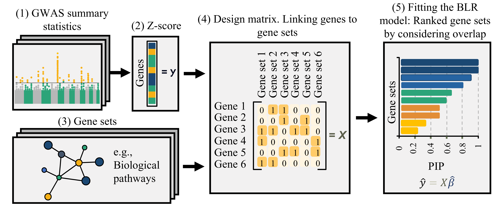{width=70%}
:::

- Fits a Bayesian regression model that allows **regularization** and **variable selection**  
- Supports **single- or multi-trait** a
nalyses  
- Identifies associated features based on **posterior inclusion probabilities** (PIPs) for the regression effects

Gholipourshahraki et al., 2025

---

## Bayesian MAGMA: Gene-level Statistics 

::: {.center}
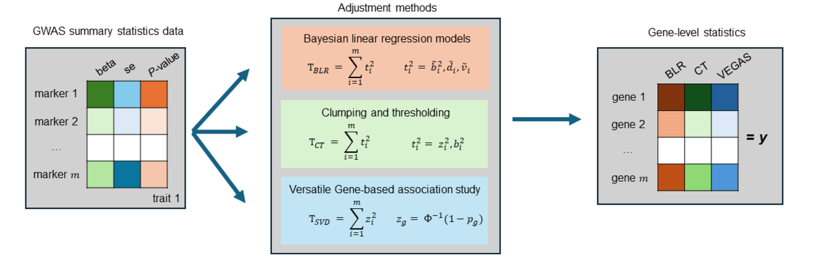{width=80%}
:::

Compute gene-level (or other feature-level) association statistics:

- Account for correlation among marker statistics (i.e., linkage disequilibrium, LD)
- Different LD-adjustment methods (e.g., SVD, clumping and thresholding, BLR)
- The choice of method depends on the quality of the available GWAS summary statistics and LD reference panel

Bai et al., 2025

<!---

## Bayesian MAGMA: Gene-level Statistics 

::: {.center}
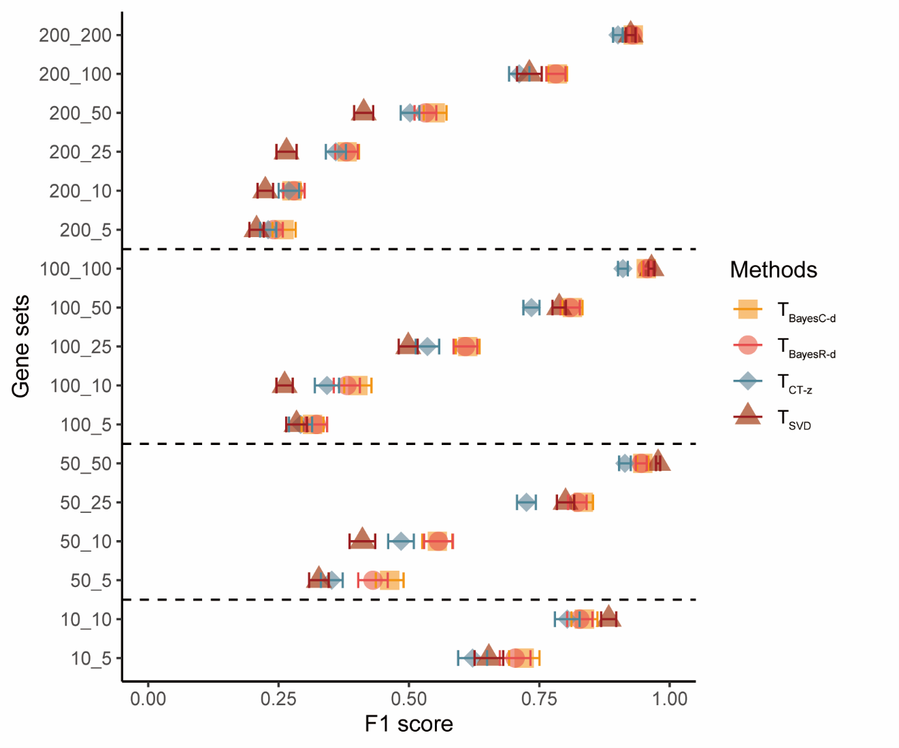{width=60%}
:::

--->

## Bayesian MAGMA – KEGG Pathway

::: {.columns}

::: {.column width="50%"}

- GWAS summary statistics from nine studies (**T2D**, **CAD**, **CKD**, **HTN**, **BMI**, **WHR**, **Hb1Ac**, **TG**, **SBP**)
- **Gene sets** are defined by genes linked to **KEGG pathways**.  
- Pathways relevant to **diabetes** are associated with **Type 2 Diabetes (T2D)** and correlated traits  

:::

::: {.column width="50%" .vcenter}

  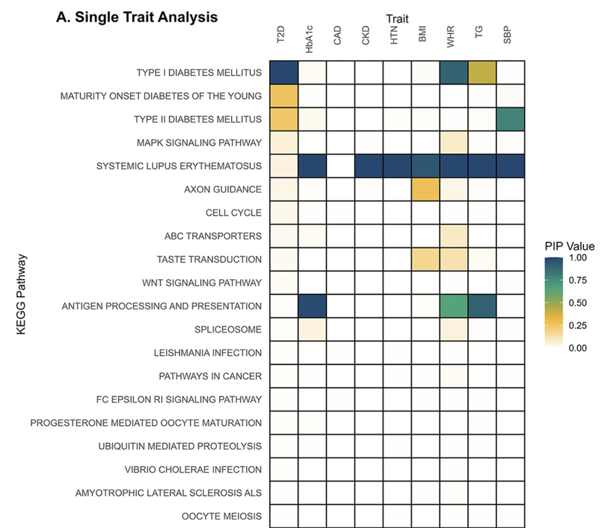

:::

:::

Gholipourshahraki et al., 2025

---

## Bayesian MAGMA – KEGG Pathway

When the **off-diagonal elements of $\boldsymbol{\Sigma}_b$ are nonzero**, the model **borrows information across correlated traits**, enabling detection of **pleiotropic effects** and **shared genetic factors**.

::: {.center}
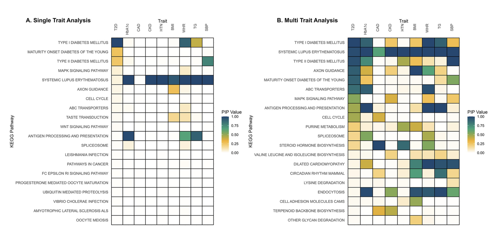{width=85%}
:::

Gholipourshahraki et al., 2025

---

## Bayesian MAGMA – DGIdb
**Gene sets** are defined by genes linked to the **Anatomical Therapeutic Chemical (ATC)** classification system using the **Drug–Gene Interaction Database (DGIdb)**

::: {.center}
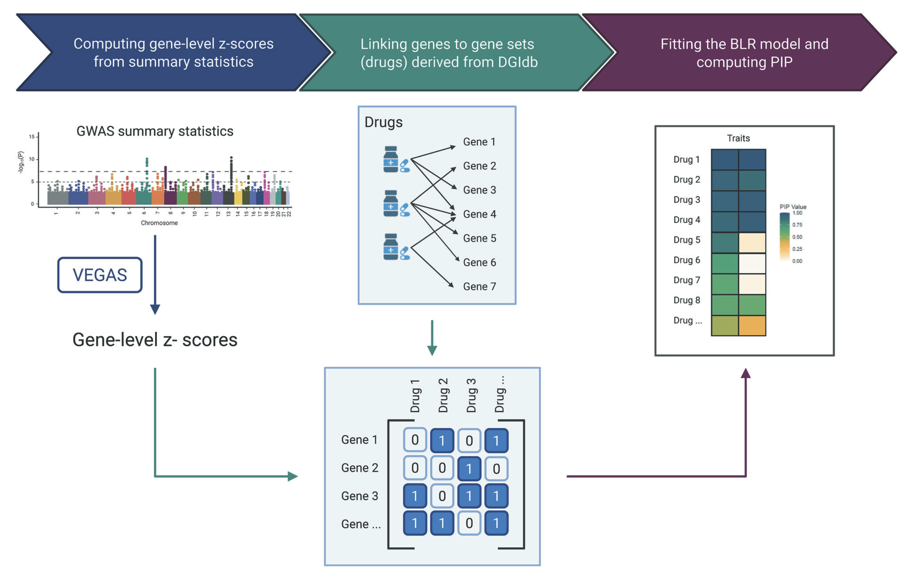{width=65%}
:::

Hjelholt et al., 2025

---

## Bayesian MAGMA – DGIdb

::: {.columns}

::: {.column width="60%"}

- Traits genetically correlated with **Type 2 Diabetes (T2D)**

  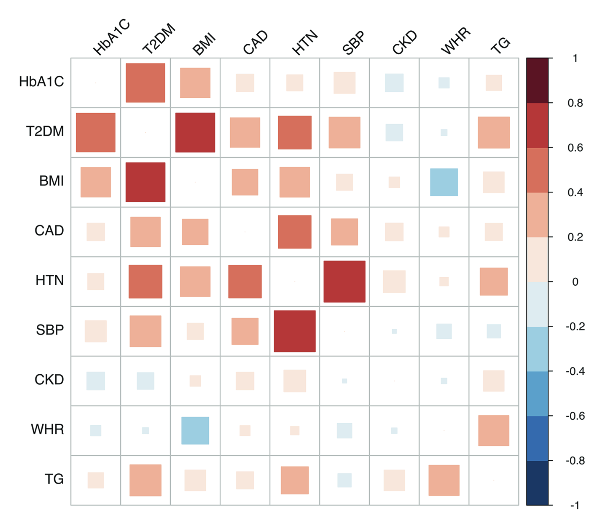

- **Drug gene sets relevant to diabetes** show associations with **T2D** and related traits  
- **Novel drug–gene set associations** may reveal opportunities for **drug repurposing**  

:::

::: {.column width="40%" .vcenter}

  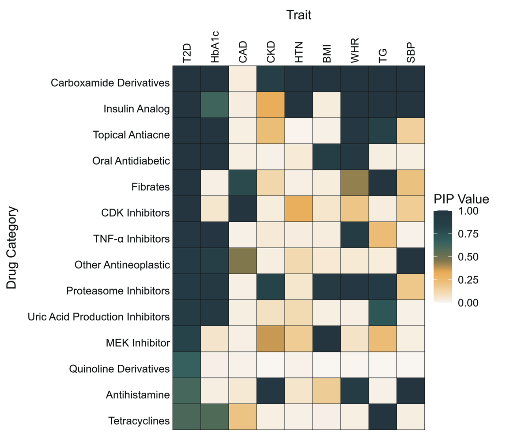

:::

:::

Hjelholt et al., 2025

---

## Bayesian MAGMA – Across Ancestries

::: {.columns}

::: {.column width="50%"}

- **Gene sets** are defined by genes linked to **KEGG pathways**.  
- Joint analysis of **T2D** across three ancestries (**EUR**, **EAS**, **SAS**).  
- Pathways relevant to **diabetes** show associations with **T2D** across two of the ancestries (**EUR** and **EAS**).  
- Comparing these associations helps reveal **ancestry-specific biological mechanisms**.

:::

::: {.column width="50%" .vcenter}

  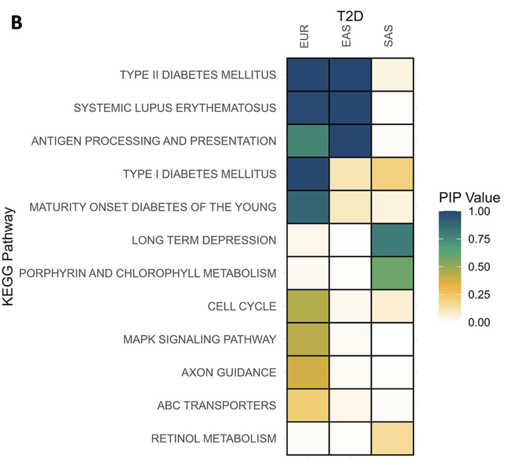

:::

:::

---

## Gene Set Analyses

Many different gene set analysis approaches have been proposed. 

- MAGMA: Multi-marker Analysis of GenoMic Annotation (Leuww et al 2015)
  - generalized gene set analysis of GWAS data
  - based on a multiple regression model
  - rank gene sets

- <strong>PoPS</strong>: Polygenic Prioritisation Scoring  (Weeks et al 2023) 

  - leveraging polygenic enrichment of gene features (e.g. gene sets) to predict genes underlying  complex diseases 
  - based on a multiple regression model
  - rank genes

## Polygenic Prioritization Scoring (PoPS)

::: {.columns}

::: {.column width="50%"}

**PoPS**

1. Fit single regression model and select top features
2. Fit multiple regression using top features with regularization (ridge)
3. Compute $\hat{\textbf{y}} = \textbf{X}\hat{\textbf{b}}$  which is the polygenic prioritisation score

:::

::: {.column width="50%" }
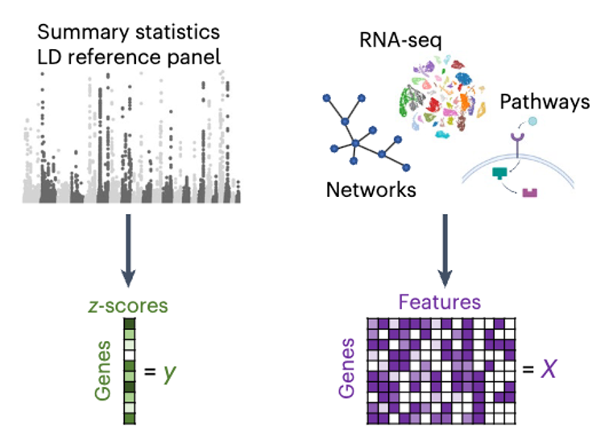{width=75% .center}

:::

:::

---

## Polygenic Prioritization Scoring (PoPS)

::: {.columns}

::: {.column width="50%"}

**PoPS**

1. Fit single regression model and select top features
2. Fit multiple regression using top features with regularization (ridge)
3. Compute $\hat{\textbf{y}} = \textbf{X}\hat{\textbf{b}}$  which is the polygenic prioritisation score

**Bayesian PoPS**

1. Fit Bayesian regression model which allow regularization and variable selection
2. Compute $\hat{\textbf{y}} = \textbf{X}\hat{\textbf{b}}$

:::

::: {.column width="50%" }
{width=75% .center}

:::

:::

---

## Bayesian PoPS

Simulation studies investigating influence of gene overlaps among the sets on the prediction accuracy \[$Cor(\textbf{y}, \hat{\textbf{y}})$\] of PoPS procedures:

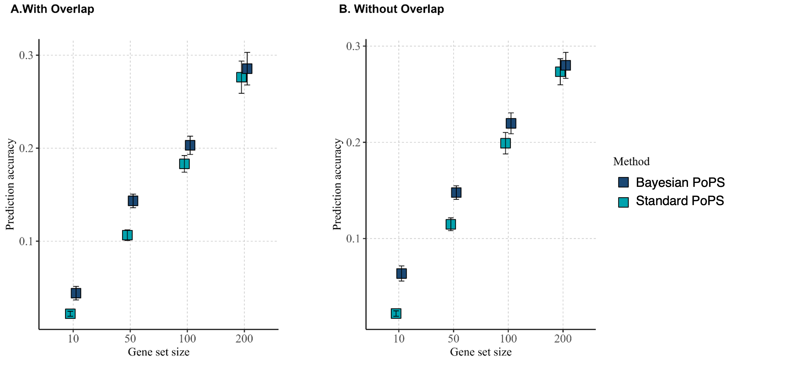{width=75% .center}

  **Bayesian PoPS** has **higher prediction accuracy** compared standard PoPS procedure

---

## Bayesian PoPS

Comparison of gene prioriterisation for Type 2 Diabetes using different PoPS procedures

::: {.columns}

::: {.column width="50%"}

- GWAS summary statistics for T2D 
- Gene sets from Reactome pathway information
- Fitted BLR models with different prior for regression effects (BayesC vs BayesR)
- Higher prediction accuracy of Bayesian PoPS procedures

:::

::: {.column width="50%" }
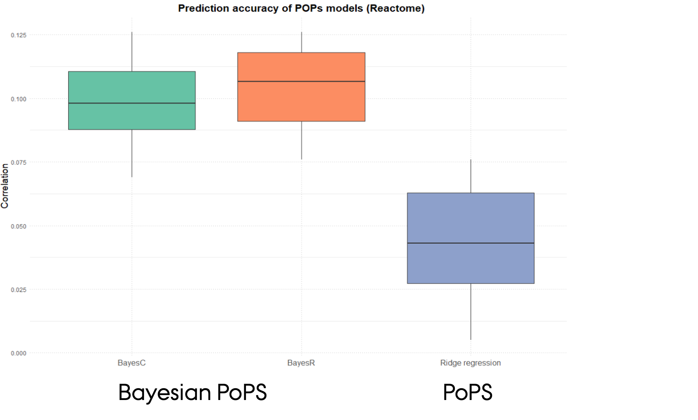{width=95% .center}

:::

:::

## Summary

**Advantages**

- Incorporates **regularization** and **variable selection** via *spike-and-slab* priors  
- Accounts for **correlated gene sets and traits**, increasing power and reducing false positives  
- Provides **posterior inclusion probabilities (PIPs)** as interpretable measures of association strength  
- Flexible framework supporting:  
  - **Single- and multi-trait models**  
  - **Integration of diverse genomic features**  
  - **Modeling of correlated traits** to uncover shared genetic architecture  

---

**Limitations**

- Dependent on the **quality and resolution** of GWAS summary statistics  
- Sensitive to **biases and incompleteness** in functional annotations (e.g., tissue specificity, experimental noise, or overrepresentation of well-studied genes)  
- **Computationally more demanding** than standard MAGMA, especially for multi-trait analyses  

**Future Work**

- Offers opportunities for **hierarchical model extensions** (e.g., grouping by genomic or functional layers)  
- **Multi-omics integration** to capture regulatory complexity across biological layers  
- Systematic **comparisons with machine learning and deep learning** methods to evaluate performance and scalability

---

## The **gact** R Package

::: {.columns}

::: {.column width="50%"}

<strong>gact</strong>  provides an infrastructure for efficient processing of large-scale genomic association data, with core functions for:

- Establishing and populating a database of genomic associations
- Downloading and processing biological databases
- Handling and processing GWAS summary statistics
- Linking genetic markers to genes, proteins, metabolites, and biological pathways
- Integrates with statistical learning methodologies from the <strong>qgg</strong>  R package

:::

::: {.column width="50%" }

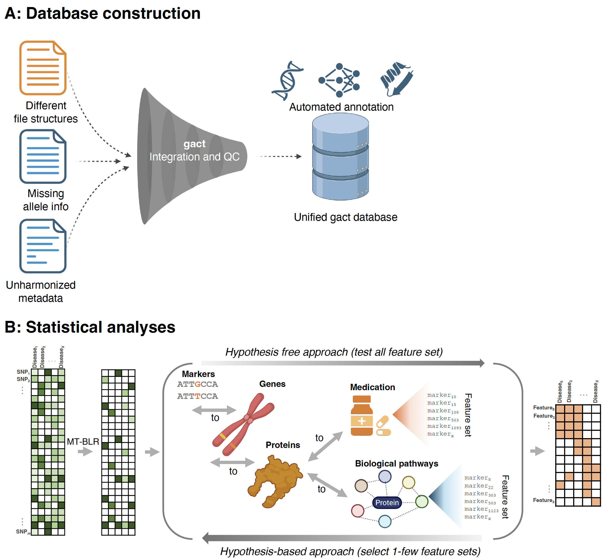{width=90% .center}

:::

:::

---

## Integrating Data with \alert{\texttt{gact}}

The `gact()` function is a single R command that creates and populates the **Genomic Association of Complex Traits (GACT) database**.

It automates three main tasks:

- **Infrastructure creation** – sets up a structured folder-based database (`glist`, `gstat`, `gsets`, `marker`, `gtex`, `download`, etc.)
- **Data acquisition** – downloads and organizes multiple biological data sources (e.g., GWAS Catalog, Ensembl, GTEx, Reactome, STRING, STITCH, DGIdb)
- **Marker and feature set generation** - integrates data across sources to create curated genomic feature sets that form the basis for the integrative genomic analyses.

---

## Biological Databases Used by **gact**

**gact** constructs **marker** and **feature sets** from a wide range of curated biological databases

- **Ensembl** — genes, transcripts, and proteins
- **Ensembl Regulation** — regulatory genomic features
- **GO, Reactome, KEGG** — ontology and pathway sets
- **STRING, STITCH** — protein and chemical complexes
- **DrugBank (ATC)** — drug–gene and drug-class associations
- **DISEASE** — disease–gene associations
- **GTEx** — eQTL-based gene sets
- **GWAS Catalog** — trait-associated variants and genes
- **Variant Effect Predictor** — functional variant annotations

*We plan to add additional biological resources in **gact** *

---

## From Database to Model Inputs

The **gact** R package includes utility functions to extract and structure data from the GACT database into analysis-ready inputs — **Y** (e.g., summary statistic outcomes, gene level association) and **X** (genomic or biological features).

- `getMarkerStat()` — retrieve GWAS summary statistics (**Y**’s)
- `getFeatureStat()` — extract gene-, protein-, or pathway-level results (**Y**’s)
- `getMarkerSets()`— define biological groupings (basis for **X**’s)
- `designMatrix()` — build feature matrices (**X**) linking variants or genes to biological feature sets

---

## **gact** is Integrated with **qgg**

$$
\mathbf{Y} = \mathbf{X}\boldsymbol{\beta} + \boldsymbol{\epsilon}
$$

::: {.columns align="center"}
::: {.column width="15%"}
{height=3em}
:::

::: {.column width="85%"}
`gact` generates $\mathbf{Y}$’s and $\mathbf{X}$’s  

<a href="https://psoerensen.github.io/gact/" style="color: var(--r-link-color);">
--> https://psoerensen.github.io/gact/</a>

(<a href="https://doi.org/10.1101/2025.10.01.25337099v1" style="color: var(--r-link-color);">
DOI: 10.1101/2025.10.01.25337099v1</a>)

:::
:::

::: {.columns align="center"}
::: {.column width="15%"}
{height=3em}
:::

::: {.column width="85%"}
`qgg` performs statistical genetic analyses  

<a href="https://psoerensen.github.io/qgg/" style="color: var(--r-link-color);">
--> https://psoerensen.github.io/qgg/</a>

(<a href="https://pubmed.ncbi.nlm.nih.gov/31883004" style="color: var(--r-link-color);">
PMID 31883004</a>
&nbsp;&amp;&nbsp;
<a href="https://pubmed.ncbi.nlm.nih.gov/37882742" style="color: var(--r-link-color);">
PMID 37882742</a>)

:::
:::

---

## References

**Sørensen P, Rohde PD.**  *A Versatile Data Repository for GWAS Summary Statistics-Based Downstream Genomic Analysis of Human Complex Traits.*  
**medRxiv** (2025). [https://doi.org/10.1101/2025.10.01.25337099](https://doi.org/10.1101/2025.10.01.25337099)

**Sørensen IF, Sørensen P.**  *Privacy-Preserving Multivariate Bayesian Regression Models for Overcoming Data Sharing Barriers in Health and Genomics.*  
**medRxiv** (2025). [https://doi.org/10.1101/2025.07.30.25332448](https://doi.org/10.1101/2025.07.30.25332448)

**Hjelholt AJ, Gholipourshahraki T, Bai Z, Shrestha M, Kjølby M, Sørensen P, Rohde P.**  *Leveraging Genetic Correlations to Prioritize Drug Groups for Repurposing in Type 2 Diabetes.*  **The Pharmagogenomics Journal** 6(25):33 (2025). [https://doi.org/10.1101/2025.06.13.25329590](https://doi.org/10.1101/2025.06.13.25329590)

**Gholipourshahraki T, Bai Z, Shrestha M, Hjelholt A, Rohde P, Fuglsang MK, Sørensen P.**  *Evaluation of Bayesian Linear Regression Models for Gene Set Prioritization in Complex Diseases.*  **PLOS Genetics** 20(11): e1011463 (2025). [https://doi.org/10.1371/journal.pgen.1011463](https://doi.org/10.1371/journal.pgen.1011463)

**Bai Z, Gholipourshahraki T, Shrestha M, Hjelholt A, Rohde P, Fuglsang MK, Sørensen P.** *Evaluation of Bayesian Linear Regression Derived Gene Set Test Methods.*  **BMC Genomics** 25(1): 1236 (2024). [https://doi.org/10.1186/s12864-024-11026-2](https://doi.org/10.1186/s12864-024-11026-2)

**Shrestha M, Bai Z, Gholipourshahraki T, Hjelholt A, Rohde P, Fuglsang MK, Sørensen P.**  *Enhanced Genetic Fine Mapping Accuracy with Bayesian Linear Regression Models in Diverse Genetic Architectures.*  **PLOS Genetics** 21(7): e1011783 (2025). [https://doi.org/10.1371/journal.pgen.1011783](https://doi.org/10.1371/journal.pgen.1011783)

**Kunkel D, Sørensen P, Shankar V, Morgante F.**  *Improving Polygenic Prediction from Summary Data by Learning Patterns of Effect Sharing Across Multiple Phenotypes.*  **PLOS Genetics** 21(1): e1011519 (2025). [https://doi.org/10.1371/journal.pgen.1011519](https://doi.org/10.1371/journal.pgen.1011519)

**Rohde P, Sørensen IF, Sørensen P.**  *Expanded Utility of the R Package qgg with Applications within Genomic Medicine.*  **Bioinformatics** 39:11 (2023). [https://doi.org/10.1093/bioinformatics/btad656](https://doi.org/10.1093/bioinformatics/btad656)

**Rohde P, Sørensen IF, Sørensen P.**  *qgg: An R Package for Large-Scale Quantitative Genetic Analyses.*  **Bioinformatics** 36(8): 2614–2615 (2020). [https://doi.org/10.1093/bioinformatics/btz955](https://doi.org/10.1093/bioinformatics/btz955)

---

## Overview of BLR Models used in Gene Set Analyses

| **Model Type** | **Feature Integration** | **Grouping Basis** | **Prior Structure** | **What It Captures** |
|:----------------|:------------------------|:-------------------|:--------------------|:---------------------|
| **Single-component BLR** | Combines all biological features in one model | None | One global variance ($\tau^2$) | All features contribute equally; uniform shrinkage |
| **Multiple-component BLR** | Integrates all layers but allows heterogeneous contributions | Learned from data | Mixture of variances ($\{\tau_k^2\}$) | Large, small, and null effect classes |
| **Hierarchical BLR** | Groups features by biological structure (e.g., genes, pathways) | Defined *a priori* | Group-specific **mixture of variances** ($\{\tau_{gk}^2\}$) | Within-group heterogeneity; enrichment and structured shrinkage |
| **Multivariate BLR** | Jointly models multiple correlated traits or outcomes | None or by trait | Shared covariance ($\boldsymbol{\Sigma}_b$) across traits | Genetic/molecular correlations; pleiotropy |
| **Hierarchical MV-BLR** | Combines biological grouping and multiple outcomes | Defined *a priori* | Group- and trait-specific covariance mixtures ($\{\boldsymbol{\Sigma}_{b,gk}\}$) | Shared biological mechanisms across traits and layers |

---

## Learning at Different Levels

| **Model Level** | **Key Parameters Learned** | **What They Represent** | **How They Are Learned** | **What We Learn Biologically** |
|:-----------------|:---------------------------|:-------------------------|:--------------------------|:-------------------------------|
| **Effect sizes** | $\boldsymbol{\beta}$ | Strength and direction of association for each feature | Posterior mean/median given priors and data | Which features drive the outcome |
| **Indicator variables** | $\delta_j$ (single trait), $\boldsymbol{\delta}_j$ (multi-trait) | Whether feature $j$ is active (and for which traits) | Estimated as posterior inclusion probabilities (PIPs) | Which features are relevant, and whether effects are shared or trait-specific |
| **Variance components** | $\tau^2$, $\{\tau_k^2\}$, $\{\tau_{gk}^2\}$ | Magnitude of expected effect sizes; heterogeneity across layers or groups | Inferred hierarchically from the data (via MCMC or EM) | How strongly different groups or omic layers contribute |
| **Covariance components** | $\boldsymbol{\Sigma}_b$, $\{\boldsymbol{\Sigma}_{b,g}\}$ | Correlation of effects across traits or molecular layers | Estimated from joint posterior | Shared pathways, pleiotropy, and cross-layer architecture |

